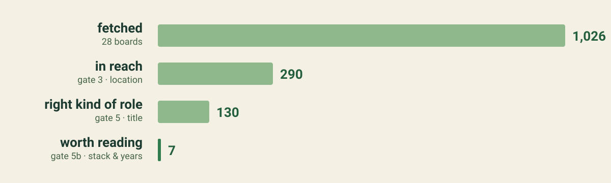
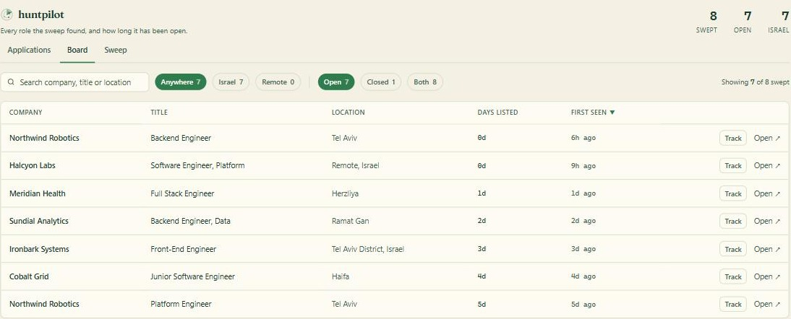
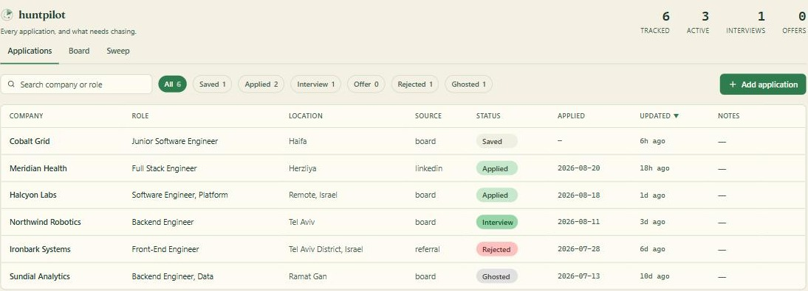
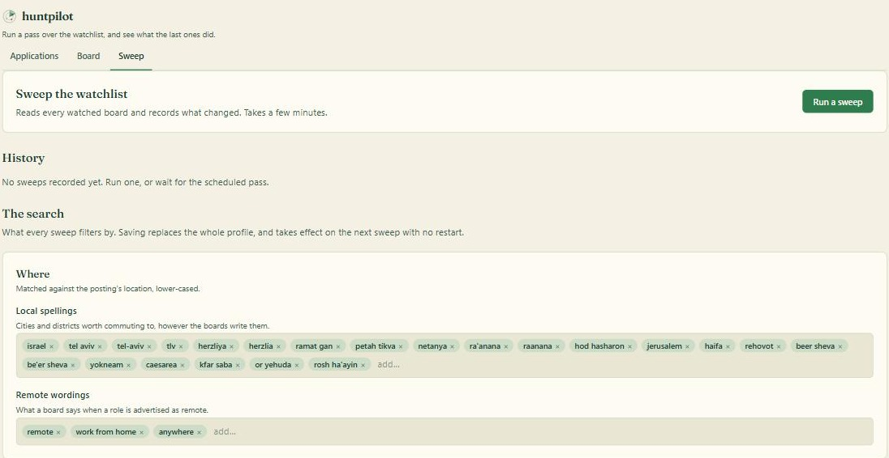
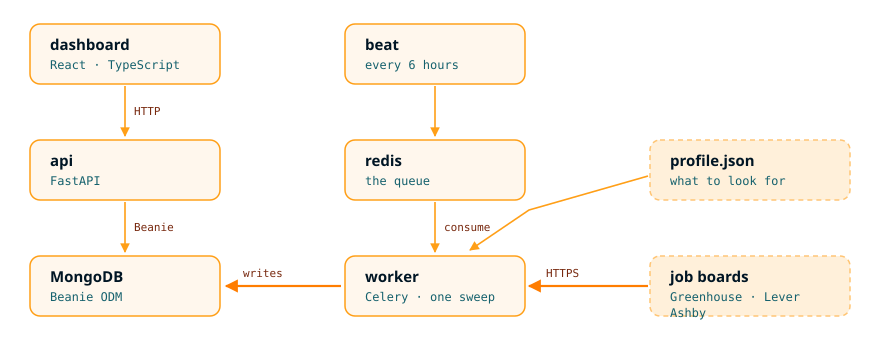

# huntpilot

[](https://github.com/kibudi/huntpilot/actions/workflows/ci.yml)
[](LICENSE)
[](api/tests)


A job-application tracker that watches company job boards on a schedule and reports what changed.

<p align="center">
  
</p>

<p align="center">
  <i>One sweep of 28 company job boards, 18 August 2026.</i>
</p>

## Highlights

- Watches [Greenhouse](https://boards-api.greenhouse.io), [Lever](https://api.lever.co) and
  [Ashby](https://api.ashbyhq.com) boards over time and reports what **changed** — the one thing no
  job board will tell you.
- Infers that a role closed from **two consecutive absences**, never from one, because boards
  intermittently omit postings that are still live.
- Filters at storage time through **numbered gates**, each of which logs what it dropped, so an
  empty digest says which gate caused it.
- Reads a **profile**, not a hard-coded preference, so the same sweep answers a different question
  for a different person.
- Tracks your own applications through `saved → applied → interview → offer | rejected | ghosted`,
  and joins them against board state, so "still live 30 days after you applied" is answerable.
- Run a sweep on demand and edit the search profile from the dashboard, no restart.
- Runs entirely **locally and free**: `docker compose up` starts the API, the dashboard, Redis, a
  Celery worker and Beat.
- 138 tests, `ruff`, `mypy --strict` and the frontend build, all enforced in CI.

## The dashboard

Three tabs. Every screenshot below is seeded with fictional companies.

**Board** — every role the sweep found, and how long it has been open. Filters narrow by region and
by open or closed; the search box covers company, title and location. The counters are swept, still
open, and in Israel. **Track** copies a swept role straight into your applications.

<p align="center">
  
</p>

**Applications** — what you have applied to and where each one stands, filtered by pipeline state.
The status pill is editable inline, so moving a job from applied to interview is one click.

<p align="center">
  
</p>

**Sweep** — run a pass on demand instead of waiting for Beat, read the history of previous passes,
and edit the search itself. Locations, remote wordings, role families and the two thresholds are
all editable as chips; saving replaces the whole profile and takes effect on the next sweep with no
restart.

<p align="center">
  
</p>

## Getting started

Requires Docker and a MongoDB connection string ([Atlas M0](https://www.mongodb.com/pricing) is
free and sufficient).

Create `.env` in the repo root:

```
MONGODB_URI=mongodb+srv://<user>:<password>@<cluster>.<id>.mongodb.net/?retryWrites=true&w=majority
MONGODB_DB=huntpilot
```

Then:

```sh
docker compose up
```

and open <http://localhost:5173>.

Compose reads that file on the host and passes the values as environment variables, so no built
image carries a credential.

## The board tracker

Job boards answer one question: what is open right now. They never tell you what *changed* — and
the changes are what matter when you are the one applying.

- The role you applied to has **disappeared**. It is filled. Stop waiting on it.
- You applied 30 days ago and the posting is **still live**. Silence is not rejection.
- The same job is **reposted** every six weeks. Churn, or a spec nobody can meet.

None of that is answerable from a single snapshot. It needs board state stored over time and joined
against the application log.

Three applicant-tracking systems publish a company's open roles as JSON with no key and no
scraping. A sweep reads every watched board, filters, and reconciles the result against what it
stored last time.

| gate | what it does | left |
|---|---|---|
| 0 · fetch | 28 boards; a failing board is skipped, never treated as empty | 1,026 |
| 1 · normalise | three payload shapes onto one internal record | |
| 3 · location | Israeli city spellings or advertised remote — country names alone miss half of them | 290 |
| 5 · title | a whitelist of five role families, and a drop for titles stating seniority | 130 |
| 5b · stack + years | share of named technologies already known, and the lowest experience figure asked for | 7 |
| 2 · reconcile | still listed, newly appeared, or absent — **this gate is the product** | |

Gate 4 (dedupe) and gate 6 (a paid model call) are designed and not built. Gate 5b was not in the
original plan and does for free most of what gate 6 was budgeted to pay for, which is why gate 6
has not been needed yet.

Run one by hand, or leave it to Beat, which runs one every six hours:

```sh
cd api && uv run python -m app.sweep
```

### Make it yours

Every filter is a profile, not a hard-coded preference: the locations worth commuting to, the role
families worth seeing, the technologies you already know, the ones you do not, the seniority words
that rule a title out, and the two thresholds.

Edit it in the **Sweep** tab and save — the change takes effect on the next sweep with no restart.
`api/app/profile.json` is the committed default and the worked example; it seeds the stored profile
once, and the stored profile is the source of truth from then on. Point `PROFILE_PATH` at your own
file to seed a different one. A bad profile is rejected with the reason, rather than silently
filtering everything away.

One real board, two profiles: Cato Networks lists 121 roles. A junior Python profile keeps none of
them today; a senior data profile keeps three — Agentic AI Engineer, Data Scientist, Field AI
Engineer.

## Architecture



The worker reaches MongoDB directly rather than through the API, because it is the same codebase
run with a different command — the sweep imports `boards.py` and `relevance.py` and would gain
nothing from a round trip through HTTP. The dashboard goes through the API. In the container image,
nginx serves the built dashboard and proxies `/api`, which is why the client calls bare `/api` paths
in both development and production.

```
api/app/     config.py  db.py  models.py  schemas.py  main.py
             boards.py     — fetching, normalising and reconciling company boards
             relevance.py  — which postings are worth storing at all
             stack.py      — scoring a description against a known stack
             profile.py    — the search itself: locations, roles, stack, thresholds
             sweep.py      — one pass over the watchlist; also `python -m app.sweep`
             worker.py     — the Celery app and the six-hourly schedule
api/tests/   conftest.py and one file per area
web/src/     App.tsx  api.ts  types.ts  state.ts  format.ts  components/
docs/        plan.html  board-tracker.md
```

## Status

**Working:** the API, the dashboard, the board tracker, the scheduled sweep, CI, containerisation.
**Not built:** the digest, the Discord bot, Kubernetes, Terraform.

Built as a learning project — the DevOps layers matter as much as the app, and everything runs
locally and free.

## Development

Running the two services directly gives you hot reload:

```sh
cd api && uv sync && uv run uvicorn app.main:app --port 8000
cd web && npm install && npm run dev
```

Vite proxies `/api` to port 8000, so the browser sees one origin either way.

```sh
cd api
uv run pytest                 # 138 tests; most need a live MongoDB
uv run mypy app tests         # strict
uv run ruff check app tests
uv run python -m app.sweep    # one sweep now, printed as JSON

cd web
npm run build                 # tsc -b && vite build
npm run lint                  # oxlint
```

The pure-function tests — `test_stack.py`, `test_relevance.py`, and the normalising and
token-guessing tests in `test_boards.py` — run without a database. Everything else needs one,
because Beanie cannot construct a `Document` before `init_beanie` has reached a server.

<details>
<summary><b>API reference</b></summary>

| method | path | |
|---|---|---|
| `GET` | `/health` | process is up; does not check the database |
| `GET` | `/api/applications` | all applications, most recently updated first |
| `POST` | `/api/applications` | create one; `409` if that `url` is already tracked |
| `PATCH` | `/api/applications/{id}` | change one; only fields sent are written; `409` if that `url` is already tracked |
| `DELETE` | `/api/applications/{id}` | remove one permanently; `204`, or `404` if already gone |
| `GET` | `/api/postings` | roles swept from company boards, newest discovery first; `?status=open\|closed` narrows it |

</details>

<details>
<summary><b>Design notes</b></summary>

**Outcomes are pipeline states, not a separate field.** `Status` is
`saved → applied → interview → offer | rejected | ghosted`. An application therefore cannot claim an
outcome it has not reached, and there is no cross-field constraint to enforce.

**Two schemas, not one.** `ApplicationCreate` forbids `id`, `created_at` and `updated_at`;
`ApplicationRead` marks them required. The same fields are optional on the way in and guaranteed on
the way out, which one class cannot express.

**MongoDB has no server-side defaults or on-update.** `updated_at` is set by the API on every write.
A write that bypasses the API leaves it stale.

**A posting link is unique, but only when there is one.** Two applications sharing a `url` are the
same job recorded twice, so the database rejects the second. The index is *partial* rather than
plain, because agency roles and undisclosed employers genuinely have no link and are stored as `""`
— a plain unique index would read every blank as a duplicate of the others and refuse to build at
all. Uniqueness is enforced by the index rather than a lookup before the insert, so two requests
arriving together cannot both pass a check and then both write.

**One document per posting for its whole life, never one per sweep.** A sweep that still sees a
posting moves `last_seen_at` in place. Appending a row per sweep would grow the collection with
elapsed time rather than with the market, for no extra signal.

**Closure is inferred from repeated absence, never from one.** No board announces that a role was
filled; the entry simply stops coming back. Boards also intermittently omit entries that are still
live, so a posting must be missing from two consecutive sweeps before it counts as closed. Closing
on the first absence would tell you a job is gone while it is still taking applications, which is
the one failure this feature cannot afford.

**A board that fails to load is skipped, not treated as empty.** Since absence is the closure
signal, handing the reconciler an empty list because a fetch failed would mark every one of that
company's roles as heading for closed, and two such sweeps would close them outright. The fetch and
the reconcile therefore sit inside one `try`, and a failure records the board and moves on.

**The dashboard never decides what counts as Israel.** The API returns each posting's region,
derived from the same list the sweep filters with. An earlier version kept a second copy in the
frontend; the two drifted, and postings in cities missing from the frontend's list were stored and
then quietly left out of the count.

**Timestamps are timezone-aware.** BSON stores no offset, so the client is created with
`tz_aware=True`. Without it, timestamps serialise with no `Z` and a client in another zone reads
them as local time.

</details>

<details>
<summary><b>Known limitations</b></summary>

- No pagination; both list endpoints return everything, and the dashboard fetches the whole board in
  one request
- Required strings accept `""`, and free text has no maximum length, so a payload over BSON's 16 MB
  limit fails as a 500 rather than a 422
- No frontend tests; the frontend is covered by `tsc -b` and oxlint only
- A posting the filter drops is never stored, so it can never be reported as closed. That is the
  accepted cost of filtering at storage time, and it widens every time a gate is tightened
- Sweep failures are counted per run but not per board, so a token that has been wrong for a week
  looks the same as one outage
- Tests need a live MongoDB — Beanie has no in-memory backend — and cannot run in parallel, because
  `init_beanie` binds document classes process-globally

</details>

## Contributing

`CONTRIBUTING.md` has the setup, the checks CI runs, and the two conventions this project is strict
about: docstrings instead of inline comments, and a test proven to fail when the bug it guards comes
back. `SECURITY.md` covers the one credential involved.

`docs/board-tracker.md` is the design note for the tracker, including the research that decided what
was feasible and what was not. `docs/plan.html` is the plan deck; some slides describe the plan
rather than what is built, and the Status section above is authoritative.

## License

MIT — see [LICENSE](LICENSE).
